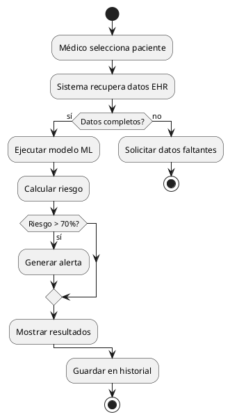
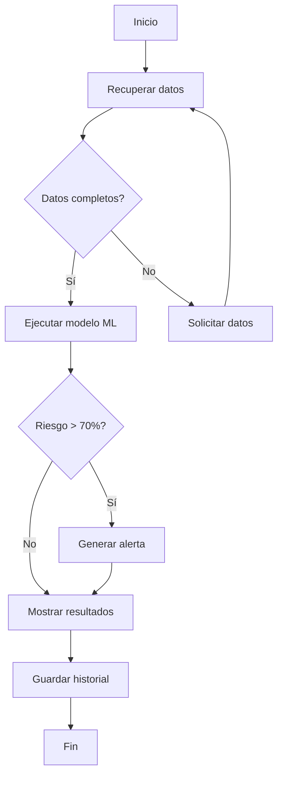

# Diagramas de Procesos e Ishikawa - ReMedical

## 1. Diagramas de Procesos

Los diagramas de procesos son representaciones visuales de flujos de trabajo, actividades y decisiones en un sistema. Son esenciales para:
- Entender procesos complejos
- Identificar cuellos de botella
- Documentar requisitos funcionales
- Comunicar con stakeholders no técnicos

### 1.1 Diagrama de Flujo (Flowchart)

#### Simbología Estándar

```
┌─────────┐
│ Inicio  │  ← Óvalo: Inicio/Fin
│  Fin    │
└─────────┘

┌─────────────────┐
│   Proceso       │  ← Rectángulo: Proceso/Acción
│  (Actividad)    │
└─────────────────┘

    ╱───────╲
   ╱         ╲  ← Rombo: Decisión (Sí/No)
  ╱  ¿Condición? ╲
  ╲           ╱
   ╲─────────╱

┌──────────────────┐
│  Documento/      │  ← Paralelogramo: Entrada/Salida
│  Base de Datos   │
└──────────────────┘

      │
      ▼         ← Flechas: Flujo de control
      │
```

#### Ejemplo: Proceso de Predicción de Diabetes en ReMedical

```
                    ┌─────────────┐
                    │   INICIO    │
                    └──────┬──────┘
                           │
                           ▼
                 ┌──────────────────────┐
                 │ Médico selecciona    │
                 │ paciente en sistema  │
                 └──────────┬───────────┘
                           │
                           ▼
                 ┌─────────────────────┐
                 │ Sistema recupera    │
                 │ datos del paciente  │
                 │ desde EHR           │
                 └──────────┬──────────┘
                           │
                           ▼
                  ╱──────────────╲
                 ╱ ¿Datos        ╲         NO
                ╱  completos?     ╲─────────────┐
                ╲                 ╱              │
                 ╲───────────────╱               │
                        │ SÍ                     │
                        ▼                        ▼
            ┌─────────────────────┐   ┌─────────────────────┐
            │ Sistema ejecuta     │   │ Solicitar datos     │
            │ modelo ML           │   │ faltantes al médico │
            │ (XGBoost/TensorFlow)│   └──────────┬──────────┘
            └──────────┬──────────┘              │
                       │                         │
                       │ ◄───────────────────────┘
                       ▼
            ┌─────────────────────┐
            │ Calcular:           │
            │ - Riesgo (%)        │
            │ - Factores clave    │
            │ - Confianza modelo  │
            └──────────┬──────────┘
                       │
                       ▼
                  ╱──────────────╲
                 ╱ ¿Riesgo >     ╲         SÍ
                ╱   70% (Alto)?   ╲─────────────┐
                ╲                 ╱              │
                 ╲───────────────╱               │
                        │ NO                     │
                        │                        ▼
                        │              ┌─────────────────────┐
                        │              │ Generar alerta      │
                        │              │ automática para     │
                        │              │ seguimiento urgente │
                        │              └──────────┬──────────┘
                        │                         │
                        ▼                         │
            ┌─────────────────────┐              │
            │ Mostrar resultados  │ ◄────────────┘
            │ en dashboard        │
            └──────────┬──────────┘
                       │
                       ▼
            ┌─────────────────────┐
            │ Médico revisa y     │
            │ guarda en historial │
            └──────────┬──────────┘
                       │
                       ▼
            ┌─────────────────────┐
            │ Sistema registra    │
            │ evento en auditoría │
            └──────────┬──────────┘
                       │
                       ▼
                  ┌─────────┐
                  │   FIN   │
                  └─────────┘
```

### 1.2 Diagrama de Actividades (UML)

Representa el flujo de control de actividades con notación UML.

#### Ejemplo: Proceso de Desarrollo de Compuesto Químico

```
                    ●  ← Inicio (nodo inicial)
                    │
                    ▼
        ┌───────────────────────────┐
        │ Identificar proteína      │
        │ objetivo (target)         │
        └───────────┬───────────────┘
                    │
                    ▼
        ┌───────────────────────────┐
        │ Búsqueda en biblioteca    │
        │ de compuestos (screening) │
        └───────────┬───────────────┘
                    │
        ┌───────────┴────────────┐  ← Fork (ejecución paralela)
        │                        │
        ▼                        ▼
┌─────────────────┐    ┌─────────────────┐
│ Simulación      │    │ Análisis de     │
│ molecular       │    │ propiedades     │
│ (docking)       │    │ ADME            │
└────────┬────────┘    └────────┬────────┘
        │                        │
        └───────────┬────────────┘  ← Join (sincronización)
                    │
                    ▼
              ◇─────────◇  ← Decisión
             ╱           ╲
            ╱ ¿Pasa      ╲
           ╱  criterios?  ╲
           ╲             ╱
            ╲───────────╱
            │          │
         NO │          │ SÍ
            │          │
            ▼          ▼
    ┌──────────┐  ┌──────────────────┐
    │ Descartar│  │ Ensayo in vitro  │
    └────┬─────┘  └────────┬─────────┘
         │                 │
         │                 ▼
         │         ◇──────────◇
         │        ╱            ╲
         │       ╱ ¿Resultados  ╲
         │      ╱  positivos?    ╲
         │      ╲               ╱
         │       ╲─────────────╱
         │        │           │
         │     NO │           │ SÍ
         │        │           │
         │        │           ▼
         │        │   ┌────────────────┐
         │        │   │ Candidato para │
         │        │   │ ensayo clínico │
         │        │   └────────┬───────┘
         │        │            │
         └────────┴────────────┘
                    │
                    ▼
                    ◉  ← Fin (nodo final)
```

### 1.3 Diagrama de Swimlane (Carriles)

Muestra procesos divididos por responsables (roles o departamentos).

#### Ejemplo: Proceso de Aprobación de Requisitos en ReMedical

```
┌──────────────────────────────────────────────────────────────────────────┐
│ MÉDICO / INVESTIGADOR                                                    │
├──────────────────────────────────────────────────────────────────────────┤
│  ┌──────────────┐                           ┌──────────────┐            │
│  │ Identificar  │                           │ Validar      │            │
│  │ necesidad    │──────────────────────────▶│ requisito    │            │
│  └──────────────┘                           └──────┬───────┘            │
│                                                     │                    │
└─────────────────────────────────────────────────────│────────────────────┘
                                                      │
┌─────────────────────────────────────────────────────│────────────────────┐
│ ANALISTA DE REQUISITOS                              │                    │
├─────────────────────────────────────────────────────│────────────────────┤
│                   ┌───────────────┐                 │                    │
│                   │ Documentar    │                 │                    │
│         ┌────────▶│ requisito en  │─────────────────┘                    │
│         │         │ Jira          │                                      │
│         │         └───────┬───────┘                                      │
│         │                 │                                              │
│         │                 ▼                                              │
│         │         ┌───────────────┐         ┌───────────────┐           │
│         │         │ Análisis de   │   NO    │ Clarificar    │           │
│         │         │ viabilidad    │────────▶│ con stakeholder│──────┐   │
│         │         └───────┬───────┘         └───────────────┘      │   │
│         │                 │ SÍ                                     │   │
│         └─────────────────┘                                        │   │
│                                                                     │   │
└─────────────────────────────────────────────────────────────────────│───┘
                                                                      │
┌─────────────────────────────────────────────────────────────────────│───┐
│ ARQUITECTO DE SOFTWARE                                              │   │
├─────────────────────────────────────────────────────────────────────│───┤
│                   ┌───────────────┐                                 │   │
│                   │ Evaluar       │◄────────────────────────────────┘   │
│                   │ impacto       │                                     │
│                   │ técnico       │                                     │
│                   └───────┬───────┘                                     │
│                           │                                             │
│                           ▼                                             │
│                   ┌───────────────┐                                     │
│                   │ Estimar       │                                     │
│                   │ esfuerzo      │                                     │
│                   └───────┬───────┘                                     │
│                           │                                             │
└───────────────────────────│─────────────────────────────────────────────┘
                            │
┌───────────────────────────│─────────────────────────────────────────────┐
│ PRODUCT OWNER                                                           │
├───────────────────────────│─────────────────────────────────────────────┤
│                           ▼                                             │
│                   ┌───────────────┐         ┌───────────────┐          │
│                   │ Priorizar en  │   NO    │ Mover a       │          │
│                   │ backlog       │────────▶│ backlog futuro│          │
│                   └───────┬───────┘         └───────────────┘          │
│                           │ SÍ                                          │
│                           ▼                                             │
│                   ┌───────────────┐                                     │
│                   │ Asignar a     │                                     │
│                   │ sprint        │                                     │
│                   └───────────────┘                                     │
│                                                                         │
└─────────────────────────────────────────────────────────────────────────┘
```

### 1.4 BPMN (Business Process Model and Notation)

Estándar internacional para modelado de procesos de negocio.

#### Ejemplo: Proceso de Integración con EHR Externo

```
   ┌─────────┐     ┌──────────────────────┐
   │ Inicio  │────▶│ Recibir solicitud    │
   │  (Evento)│     │ de datos de paciente│
   └─────────┘     └──────────┬───────────┘
                              │
                              ▼
                    ┌──────────────────────┐
              ┌────▶│ Validar credenciales │
              │     │ API (OAuth 2.0)      │
              │     └──────────┬───────────┘
              │                │
              │                ▼
              │         ◇─────────────◇
              │        ╱               ╲
              │       ╱ ¿Autenticación  ╲      NO
              │      ╱  exitosa?         ╲─────────┐
              │      ╲                   ╱         │
              │       ╲─────────────────╱          │
              │                │ SÍ                │
              │                ▼                   │
              │     ┌────────────────────┐         │
              │     │ Consultar EHR      │         │
              │     │ (API REST/FHIR)    │         │
              │     └──────────┬─────────┘         │
              │                │                   │
              │                ▼                   │
              │         ◇──────────────◇           │
              │        ╱                ╲          │
              │       ╱ ¿Datos          ╲   NO    │
              │      ╱  disponibles?     ╲────┐   │
              │      ╲                   ╱    │   │
              │       ╲─────────────────╱     │   │
              │                │ SÍ           │   │
              │                ▼              │   │
              │     ┌────────────────────┐    │   │
              │     │ Transformar datos  │    │   │
              │     │ a formato interno  │    │   │
              │     └──────────┬─────────┘    │   │
              │                │              │   │
              │                ▼              │   │
              │     ┌────────────────────┐    │   │
              │     │ Validar integridad │    │   │
              │     │ de datos (schema)  │    │   │
              │     └──────────┬─────────┘    │   │
              │                │              │   │
              │                ▼              ▼   ▼
              │     ┌────────────────────────────────┐
              │     │ Registrar en log de auditoría │
              │     └──────────┬─────────────────────┘
              │                │
              │                ▼
              │         ◇──────────────◇
              │        ╱                ╲
              │       ╱ ¿Error durante  ╲    SÍ
              │      ╱  proceso?         ╲────────┐
              │      ╲                   ╱        │
              │       ╲─────────────────╱         │
              │                │ NO               │
              │                ▼                  │
              │     ┌────────────────────┐        │
              │     │ Retornar datos     │        │
              │     │ (JSON response)    │        │
              │     └──────────┬─────────┘        │
              │                │                  │
              │                ▼                  ▼
              │         ┌─────────────┐   ┌────────────┐
              │         │ Fin exitoso │   │ Fin con    │
              │         │             │   │ error      │
              │         └─────────────┘   └──────┬─────┘
              │                                   │
              │                                   │
              └───────────────────────────────────┘
                          (Reintento con
                           backoff exponencial)
```

---

## 2. Diagrama de Ishikawa (Causa-Efecto o Espina de Pescado)

### ¿Qué es?

El Diagrama de Ishikawa, también conocido como diagrama de causa-efecto o espina de pescado, es una herramienta de análisis que ayuda a identificar las causas raíz de un problema específico.

**Inventado por**: Kaoru Ishikawa (1960s)

**Categorías Típicas (6M)**:
1. **Mano de Obra** (Manpower)
2. **Métodos** (Methods)
3. **Máquinas** (Machines)
4. **Materiales** (Materials)
5. **Medición** (Measurement)
6. **Medio Ambiente** (Environment)

### Estructura Básica

```
                            Causa 1
                              │
                              │
     Causa A                  │                    Causa B
         │                    │                        │
         │                    │                        │
──────────┴────────────────────┴────────────────────────┴──────────▶ EFECTO
                              │                                    (Problema)
                              │
                              │
                           Causa 2
```

### 2.1 Ejemplo: Baja Adopción de la Plataforma ReMedical por Médicos

```
    MÉTODOS                           PERSONAS
        │                                 │
        │ Falta de                        │ Resistencia al
        │ capacitación                    │ cambio
        │                                 │
        │ Proceso de login                │ Falta de tiempo
        │ complejo (5 pasos)              │ para capacitación
        │                                 │
        │ Documentación                   │ Creencias sobre IA
        │ insuficiente                    │ (desconfianza)
        │                                 │
────────┴─────────────────────────────────┴──────────────▶ BAJA ADOPCIÓN
                                          │              DE PLATAFORMA
        │                                 │              REMEDIAL
        │ UI no intuitiva                 │
        │                                 │
        │ Respuesta lenta                 │ No integra con
        │ (>5 seg)                        │ sistema actual
        │                                 │
        │ Errores frecuentes              │ Falta wifi en
        │ en producción                   │ hospitales
        │                                 │
        │ No compatible                   │ Regulaciones de
        │ con móviles                     │ privacidad poco claras
        │                                 │
    TECNOLOGÍA                        ENTORNO/INFRAESTRUCTURA
```

**Acciones Derivadas**:
- **Métodos**: Simplificar proceso de login a 2 pasos (SSO)
- **Personas**: Programa de capacitación de 2 horas con certificación
- **Tecnología**: Optimizar rendimiento (<2 seg respuesta), tests automatizados
- **Entorno**: Modo offline para zonas sin wifi, clarificar cumplimiento HIPAA

### 2.2 Ejemplo: Predicciones Incorrectas del Modelo de IA

```
      DATOS                            ALGORITMO
        │                                 │
        │ Datos desbalanceados            │ Hiperparámetros
        │ (90% sin diabetes)              │ no optimizados
        │                                 │
        │ Datos históricos                │ Modelo muy simple
        │ desactualizados                 │ (regresión lineal)
        │                                 │
        │ Falta feature                   │ Overfitting en
        │ engineering                     │ datos de entrenamiento
        │                                 │
────────┴─────────────────────────────────┴──────────────▶ PREDICCIONES
                                          │              INCORRECTAS DE
        │                                 │              DIABETES (70% acc)
        │ Métricas incorrectas            │
        │ (solo accuracy)                 │
        │                                 │ Validación con
        │ No validación                   │ dataset pequeño
        │ con médicos                     │ (100 pacientes)
        │                                 │
        │ Falta validación                │ No considera
        │ cruzada                         │ diversidad étnica
        │                                 │
        │ Bias en selección               │ Falta variables
        │ de features                     │ contextuales
        │                                 │
     EVALUACIÓN                         CONTEXTO
```

**Acciones Derivadas**:
- **Datos**: 
  - Aplicar SMOTE para balancear clases
  - Incorporar datos de últimos 2 años
  - Feature engineering: crear ratios glucosa/edad, interacciones
- **Algoritmo**: 
  - Probar XGBoost, Random Forest, Neural Networks
  - Grid search para hiperparámetros
  - Regularización (L1/L2) para evitar overfitting
- **Evaluación**: 
  - Usar F1-score, AUC-ROC, Precision-Recall
  - Validación cruzada 10-fold
  - Validación con panel de endocrinólogos
- **Contexto**: 
  - Incluir variables: etnia, geografía, socioeconómicos
  - Segmentar modelos por población

### 2.3 Ejemplo: Retrasos en Desarrollo de Funcionalidades

```
   PLANIFICACIÓN                      EQUIPO
        │                                 │
        │ Requisitos                      │ Falta de developers
        │ cambiantes                      │ senior
        │                                 │
        │ Sin priorización                │ Alta rotación
        │ clara (todo urgente)            │ de personal (30%)
        │                                 │
        │ Sprints muy largos              │ Conocimiento no
        │ (4 semanas)                     │ documentado
        │                                 │
────────┴─────────────────────────────────┴──────────────▶ RETRASOS EN
                                          │              DESARROLLO
        │                                 │              (50% sprints fallidos)
        │ Deuda técnica                   │
        │ acumulada                       │
        │                                 │ Muchas reuniones
        │ Falta CI/CD                     │ (4h diarias)
        │                                 │
        │ Tests manuales                  │ Comunicación
        │ (consume 40% tiempo)            │ asíncrona deficiente
        │                                 │
        │ Dependencias                    │ Aprobaciones lentas
        │ externas (APIs)                 │ de stakeholders
        │                                 │
      TECNOLOGÍA                         PROCESOS
```

**Acciones Derivadas**:
- **Planificación**: 
  - Implementar MoSCoW para priorización
  - Sprints de 2 semanas
  - Congelar scope durante sprint
- **Equipo**: 
  - Contratar 2 senior developers
  - Programa de retención (bonos, capacitación)
  - Documentación obligatoria en Confluence
- **Tecnología**: 
  - Implementar pipeline CI/CD (GitLab)
  - Automatizar testing (cobertura >80%)
  - Refactoring semanal para reducir deuda técnica
- **Procesos**: 
  - Limitar reuniones a 2h/día
  - Daily standups de 15 min estrictos
  - SLA de 24h para aprobaciones de stakeholders

---

## 3. Integración de Diagramas en Gestión de Requisitos

### 3.1 Flujo Completo: De Requisito a Implementación

```
1. REQUISITO (Historia de Usuario)
   "Como médico quiero predecir riesgo de diabetes"
          │
          ▼
2. DIAGRAMA DE PROCESOS (Flowchart)
   Documenta flujo detallado del proceso
          │
          ▼
3. ANÁLISIS DE PROBLEMAS (Ishikawa)
   Identifica obstáculos potenciales
          │
          ▼
4. CASOS DE USO (Diagrama UML)
   Especifica interacciones sistema-usuario
          │
          ▼
5. DISEÑO (Diagramas de Secuencia/Componentes)
   Arquitectura técnica de la solución
          │
          ▼
6. IMPLEMENTACIÓN
   Código Python/React/SQL
          │
          ▼
7. TESTING
   Casos de prueba basados en diagramas
          │
          ▼
8. DESPLIEGUE
   Release a producción
```

### 3.2 Documentación en Jira

**Integración de Diagramas en Historias de Usuario**:

```
Historia: REMED-123
Título: Predicción de Riesgo de Diabetes con IA

Descripción:
Como médico endocrinólogo
Quiero predecir el riesgo de diabetes tipo 2 de mis pacientes
Para intervenir proactivamente con planes de prevención

Criterios de Aceptación:
✓ Predicción en <3 segundos
✓ Precisión >90% (F1-score)
✓ Explicabilidad de factores de riesgo
✓ Integración con EHR existente

📎 Adjuntos:
- flowchart_prediccion_diabetes.png
- ishikawa_problemas_modelo_ia.pdf
- caso_uso_CU001.docx

🔗 Enlaces:
- Confluence: Especificación Técnica Detallada
- Figma: Mockups de UI
```

---

## 4. Herramientas para Crear Diagramas

### 4.1 Herramientas de Diagramado

| Herramienta | Tipo | Mejor Para | Costo |
|-------------|------|-----------|-------|
| **Draw.io** (diagrams.net) | Web/Desktop | Flowcharts, UML, BPMN | Gratis |
| **Lucidchart** | Web | Colaboración en tiempo real | $7.95/mes |
| **Microsoft Visio** | Desktop | Diagramas empresariales | $15/mes |
| **PlantUML** | Código | Diagramas como código (DevOps) | Gratis |
| **Miro** | Web | Workshops colaborativos | $8/mes |
| **Whimsical** | Web | Flowcharts rápidos | $10/mes |
| **Creately** | Web | Templates extensos | $5/mes |

### 4.2 Diagramas como Código

**Ventajas**:
- Versionamiento en Git
- Revisión en Pull Requests
- Integración en CI/CD
- Documentación autogenerada

**Ejemplo con PlantUML**:



**Ejemplo con Mermaid** (integrado en Markdown/GitHub):



---

## 5. Mejores Prácticas

### Para Diagramas de Procesos:
1. ✅ Mantener simplicidad (máximo 15-20 elementos)
2. ✅ Usar nomenclatura consistente
3. ✅ Incluir roles/responsables claramente
4. ✅ Documentar excepciones y flujos alternativos
5. ✅ Validar con usuarios finales
6. ❌ Evitar cruces de líneas innecesarios
7. ❌ No mezclar niveles de detalle (macro vs micro)

### Para Diagramas de Ishikawa:
1. ✅ Enfocarse en UN problema específico
2. ✅ Involucrar equipo multidisciplinario en sesión de brainstorming
3. ✅ Usar las 6M como categorías base (adaptar si es necesario)
4. ✅ Profundizar preguntando "¿Por qué?" 5 veces (técnica 5 Whys)
5. ✅ Priorizar causas raíz con datos (Pareto 80/20)
6. ❌ No confundir síntomas con causas raíz
7. ❌ No quedarse en el diagrama: definir plan de acción

---

## Referencias

- ISO/IEC 19510:2013 - Business Process Model and Notation (BPMN)
- Object Management Group (OMG). (2017). Unified Modeling Language (UML) 2.5.1
- Ishikawa, K. (1990). Introduction to Quality Control
- Dumas, M., et al. (2018). Fundamentals of Business Process Management (2nd ed.)
- Silver, B. (2011). BPMN Method and Style (2nd ed.)
